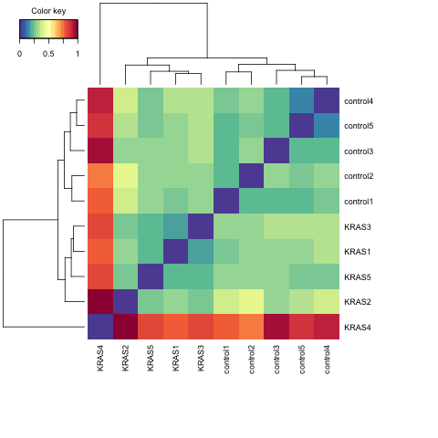
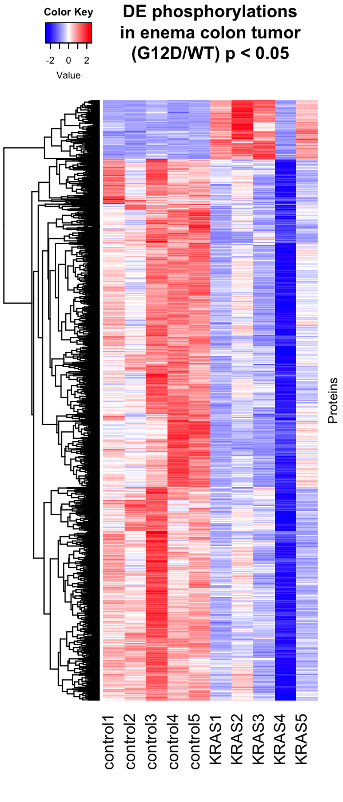

```{r setup, include=FALSE}
knitr::opts_chunk$set(echo = TRUE)
```

## Proteomics dataset 
This is analysis for the phospho-proteomics dataset generated using mouse colon tumor samples from Villin-CreER;Apc(fl/fl);KRasWT and Villin-CreER;Apc(fl/fl);KRasG12D mice. Tumor was induced through enema of 4-OHT in experimental and control mice. Emily Poulin harvested the tissue samples and the proteomics were performed by Joao Paulo. Part of the analysis code was adapted from original script from Shikha Sheth.

## Library loading and set up
```{r message=FALSE, warning=FALSE}
options(connectionObserver = NULL)

library(gridExtra)
library(ensembldb)
library(EnsDb.Mmusculus.v79)
library(grid)
library(ggplot2)
library(lattice)
library(reshape)
library(mixOmics)
library(gplots)
library(RColorBrewer)
library(readr)
library(dplyr)
library(VennDiagram)
library(clusterProfiler)
library(DOSE)
library(org.Mm.eg.db)
library(pathview)
library(AnnotationDbi)
library(tidyr)
library(qdapRegex)
library(gtools)
library(ggfortify)
```

## Load the proteomics dataset and statistical analysis
The original dataset was loaded.
```{r message=FALSE, warning=FALSE}
tumor_proteom <- read_csv("2017-03-19_Haigis_5v5_Phos.csv", col_types = cols(`Site Position` = "c"))
```

### Calculate the stats for G12D/WT
```{r}
# establish a new data frame for collecting stats
tumor_stats <- tumor_proteom[,1:5]
# Calculate the pvalue using parametric unpaired t test
p_value_list <- c()
for (i in 1:dim(tumor_proteom)[1]) {
  p_value <- t.test(unlist(tumor_proteom[i,11:15]), unlist(tumor_proteom[i,6:10]), paired = FALSE)$p.value
  p_value_list <- c(p_value_list, p_value)
}
tumor_stats <- cbind(tumor_stats, p_value_list)
colnames(tumor_stats)[6] <- "p_values" 

# calculate the q value using Benjamini Hochberg FDR correction
q_value_list <- p.adjust(tumor_stats$p_values, method = "BH")
tumor_stats <- cbind(tumor_stats, q_value_list)
colnames(tumor_stats)[7] <- "q_values"

# calculate fold change and log fold change
foldchange_list <- c()
for (i in 1:dim(tumor_proteom)[1]) {
  foldchange <- foldchange(mean(unlist(tumor_proteom[i,11:15])), mean(unlist(tumor_proteom[i,6:10])))
  foldchange_list <- c(foldchange_list, foldchange)
}
logfoldchange_list <- foldchange2logratio(foldchange_list)
tumor_stats <- cbind(tumor_stats, foldchange_list, logfoldchange_list)
colnames(tumor_stats)[8:9] <- c("foldChange", "LFC")
```

Now we output this statistical analysis file into a `csv` file.
```{r}
write.csv(tumor_stats, "crcMS_phospho_diff.csv", col.names = NULL)
```

Just to check how many siginificant proteins do we have based on p< 0.05 and q< 0.1
```{r}
sig_dif_stats <- subset(tumor_stats, tumor_stats$p_values <= 0.05 & tumor_stats$q_values <= 0.1)

dim(sig_dif_stats)[1]
```
No phosphosite passed the threshold. 

Now if we just look at p < 0.05
```{r}
sig_dif_stats <- subset(tumor_stats, tumor_stats$p_values <= 0.05)

dim(sig_dif_stats)[1]
```
We have 2124 phosphosites with p < 0.05.

## Plot PCA and hierchical clustering
### PCA plot
Since the number of significant changes are quite small, I want to use PCA to check how the samples cluster.
```{r}
df <- tumor_proteom[6:15]
df <- as.data.frame(t(df))
df <- cbind(df, c('WT','WT','WT','WT','WT','G12D','G12D','G12D','G12D','G12D'))
colnames(df)[24232] <- 'Genotype'
df.set <- as.matrix(df[,1:24231])
df.pca <- prcomp(df.set, center = TRUE, scale = TRUE)
autoplot(df.pca, data = df, colour = 'Genotype') +
  geom_text(aes(label=rownames(df)), vjust = 2, hjust = -0.1) +
  xlim(-0.9, 0.5) + ylim(-0.5, 0.4)
```

### Hierchical clustering
```{r}
pseudoCount = log2(tumor_proteom[6:15])

# remove NA, NaN, Inf values from the dataframe
pseudoCount <- na.omit(pseudoCount)
pseudoCount <- pseudoCount[is.finite(rowSums(pseudoCount)),]

mat.dist = pseudoCount
mat.dist = as.matrix(dist(t(mat.dist)))
mat.dist = mat.dist/max(mat.dist)
png('Hierchical_Clustering_Phospho.png')
cim(mat.dist, symkey = FALSE, margins = c(10, 10 ))
suppressMessages(dev.off())
```
Final output is following:


## Plot heatmap, scatterplot, MA plot, and volcano plot
### Heatmap
For heatmap, I will z-score all quantifications across all samples for the same protein. Heatmaps for all phosphosites with p<0.05 are plotted
```{r}
suppressMessages(library(mosaic))
sig_dif_stats <- sig_dif_stats %>% mutate(site_ID = paste(sig_dif_stats$`Protein Id`, sig_dif_stats$`Site Position`, sep = "_"))

tumor_proteom <- tumor_proteom %>% mutate(site_ID = paste(tumor_proteom$`Protein Id`, tumor_proteom$`Site Position`, sep = "_"))

sig_count <- tumor_proteom[tumor_proteom$site_ID %in% sig_dif_stats$site_ID,]
sig_dif <- cbind(sig_dif_stats, sig_count[,6:15])
for (i in 1:dim(sig_dif)[1]) {
  sig_dif[i,11:20] <- zscore(as.numeric(sig_dif[i,11:20]))
}

my_palette <- colorRampPalette(c("blue", "white", "red"))(256)
heatmap_matrix <- as.matrix(sig_dif[,11:20])

png('G12D vs WT colon tumor phospho-proteomics.png',
    width = 600,
    height = 1400,
    res = 200,
    pointsize = 8)
par(cex.main=1.1)
heatmap.2(heatmap_matrix,
          main = "DE phosphorylations\nin enema colon tumor\n(G12D/WT) p < 0.05",
          density.info = "none",
          key = TRUE,
          lwid = c(3,7),
          lhei = c(1,7),
          col=my_palette,
          margins = c(8,2),
          symbreaks = TRUE,
          trace = "none",
          dendrogram = "row",
          labRow = FALSE,
          ylab = "Proteins",
          cexCol = 1.5,
          Colv = "NA")
dev.off()
```
Final output is 

#### Scatter plot, MA plot and Volcano plot for data visualization
```{r}
# Scatter plot
tumor_stats$KrasG12D_mean <- rowMeans(log2(tumor_proteom[,11:15]))
tumor_stats$KrasWT_mean <- rowMeans(log2(tumor_proteom[,6:10]))
ggplot(tumor_stats, aes(x = KrasWT_mean, y = KrasG12D_mean)) +
  xlab("WT_Average(log2)") + ylab("G12D_Average(log2)") + 
  geom_point(data = tumor_stats, alpha = 0.5, size = 1, color = "grey") +
  geom_point(data = subset(tumor_stats,tumor_stats$p_values < 0.05 & tumor_stats$LFC > 0), alpha = 0.5, size = 1, color = "red") +
  geom_point(data = subset(tumor_stats,tumor_stats$p_values < 0.05 & tumor_stats$LFC < 0), alpha = 0.5, size = 1, color = "blue") +
  labs(title = "G12D vs WT Scatter Plot")

# MA plot
tumor_stats$'baseMean' <- rowMeans(tumor_proteom[,6:15])
tumor_stats$'log2baseMean' <- log(tumor_stats$`baseMean`,2)
red_subset <- subset(tumor_stats,tumor_stats$p_values < 0.05 & tumor_stats$LFC > 0)
blue_subset <- subset(tumor_stats,tumor_stats$p_values < 0.05 & tumor_stats$LFC < 0)
ggplot(tumor_stats, aes(x = `log2baseMean`, y = `LFC`)) +
  xlab("Average Expression") + ylab("LFC") +
  geom_point(data = tumor_stats, alpha = 0.5, size = 1, color = "grey") +
  geom_point(data = red_subset, aes(x=`log2baseMean`, y=`LFC`), alpha = 0.5, size = 1, color = "red") +
  geom_point(data = blue_subset, aes(x=`log2baseMean`, y=`LFC`), alpha = 0.5, size = 1, color = "blue") +
  labs(title = "G12D vs WT MA Plot")

# Volcano Plot
ggplot(tumor_stats, aes(x = `LFC`, y = -log(`p_values`,10))) +
  xlab("LFC") + ylab("-log10(P value)") + 
  geom_point(data = tumor_stats, alpha = 0.5, size = 1, color = "grey") +
  geom_point(data = red_subset, aes(x=`LFC`, y=-log(`p_values`,10)), alpha = 0.5, size = 1, color = "red") +
  geom_point(data = blue_subset, aes(x=`LFC`, y=-log(`p_values`,10)), alpha = 0.5, size = 1, color = "blue") +
labs(title = "G12D vs WT Volcano Plot")
```

## SessionInfo
```{r}
sessionInfo()
```